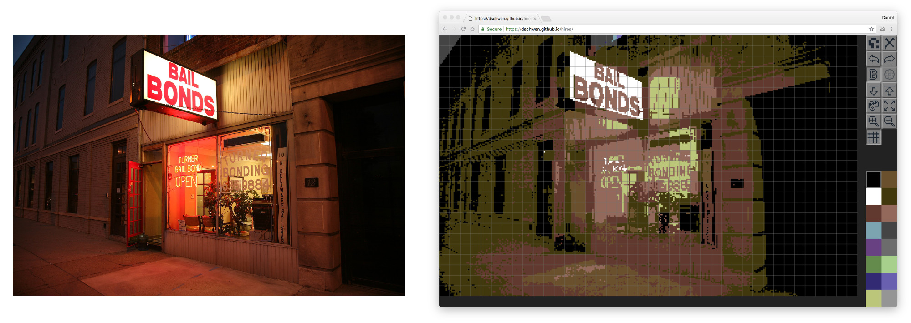

# HiRes

A Commodore 64 hires mode image editor

Use it at [https://dschwen.github.io/hires/](https://dschwen.github.io/hires/)

* Tested in Chrome, Firefox, Safari
* Unlimited undo levels
* Fullscreen mode
* Mobile support (including Samsung S-Pen)
* Retro look
* Import (drag and drop and toolbar button)
* Export to png (reimport without loss)
* Drawing tools: Pixel pen, line, circle, block
* Two modes for handling hires color restriction
* Horizontal (`h`) and vertical (`v`) flip
* Image recovers on accidental browser close
* 8x8 grid
